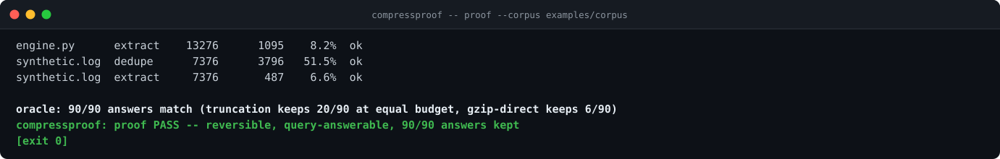
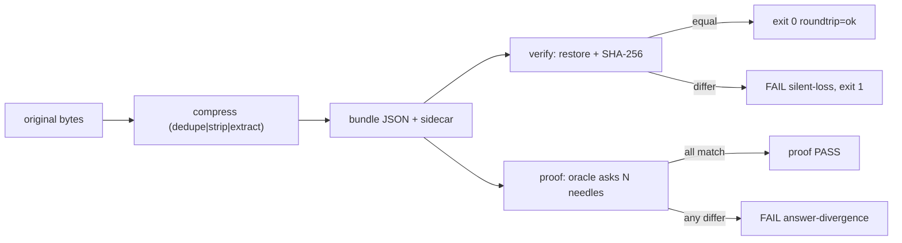

[](https://github.com/F0Rextasy/compressproof/actions/workflows/test.yml)
[](https://www.python.org/)
[](#what-it-will-never-do)
[](#what-it-will-never-do)
[](https://skills.sh/F0Rextasy/compressproof)
[](LICENSE)

# compressproof

**Your context window shrank and the answer went with it.** Truncation
drops the needle, summarizers paraphrase away the exact string, and
nobody can prove the smaller prompt still answers the same questions.
`compressproof` shrinks text three lossless ways -- dedupe, reversible
strip, query-extract with a sidecar -- and **proves** every byte
survives: `verify` restores the original and compares SHA-256, and the
`proof` harness answers the same needle questions on the original and
the compressed form.



## The problem is real

- The #1 complaint about AI-era development is context: agents re-read
  the same files, paste the same tool output, and blow the window on
  duplicated bytes that carry zero new information.
- The niche is pre-wave, not owned: token-trimming prompts and lossy
  summarizers dominate, but nobody ships a deterministic, offline,
  exit-code compressor whose round-trip is byte-exact by construction.
- Every claim here is byte-level measurement + one arithmetic pass
  over a corpus you can re-run with a single command.

## Quickstart

```bash
# install the skill into any agent (Claude Code, Codex, Cursor, OpenCode, ...):
npx skills add F0Rextasy/compressproof

# or run it directly:
git clone https://github.com/F0Rextasy/compressproof

# shrink a log to its ERROR lines, keeping dropped bytes for restore:
python compressproof/scripts/compressproof compress --mode extract --in big.log --out small.json --sidecar small.sidecar --query ERROR

# prove the bytes survive:
python compressproof/scripts/compressproof verify --orig big.log --bundle small.json --sidecar small.sidecar

# run the full corpus proof (round-trip table + needle oracle + baselines):
python compressproof/scripts/compressproof proof --corpus examples/corpus --needles examples/needles.json --results examples/results/proof.json
```

Exit `1` = `silent-loss` / `sidecar-mismatch` / answer divergence,
`0` = round-trip clean, `2` = usage error. Python 3.8+ stdlib only;
**no network calls, ever** - the harness reads committed files.

## Usage patterns

| Situation | Command |
| --- |---|
| repeated tool outputs blew up the context | `compress --mode dedupe --in ctx.txt --out ctx.json` |
| padded / noisy log capture | `compress --mode strip --in raw.log --out lean.json` |
| keep only the failing lines, restore later | `compress --mode extract --query ERROR --in big.log --out small.json --sidecar small.sidecar` (regex: add `--regex`) |
| prove one file survived | `verify --orig big.log --bundle small.json --sidecar small.sidecar` |
| prove the whole corpus + oracle | `proof --corpus examples/corpus --needles examples/needles.json --results examples/results/proof.json` |
| machine-readable report | `--format json` -> `bytes_in`, `bytes_out`, `ratio`, `sha256_in`, `sha256_out`, `roundtrip`, `findings` |

## Modes

| Mode | Transform id | Shrinks when |
| --- | --- | --- |
| `dedupe` | `dedupe-v1:line-sha256-index` | lines repeat: re-read files, duplicated log blocks, pasted tool output |
| `strip` | `strip-v1:trail+blank` | trailing whitespace / blank-run padding (every removed byte recorded, restore is exact) |
| `extract` | `extract-v1:line-filter+sidecar` | only `--query` lines matter now; dropped bytes live in the sidecar for exact restore |

Findings name the bundle file:

| Rule | Severity | Fires when |
| --- | --- | --- |
| `silent-loss` | fail | restored bytes differ from the original -- the transform is not reversible for this input |
| `sidecar-mismatch` | fail | sidecar bytes do not hash to the `sidecar_sha256` recorded in the bundle |
| `answer-divergence` | fail | a needle question answers differently on the compressed form than on the original |
| `roundtrip-failure` | fail | a corpus file did not restore byte-exact in some mode |

## How the pieces fit



## Evidence

Real output over the committed corpus (also the demo above):

```console
$ python scripts/compressproof --no-color proof --corpus examples/corpus --needles examples/needles.json --results examples/results/proof.json
file           mode    bytes_in bytes_out   ratio  roundtrip
engine.py      dedupe     13276     31645  238.4%  ok
engine.py      strip      13276     27728  208.9%  ok
engine.py      extract    13276      1095    8.2%  ok
padded.txt     dedupe       108       722  668.5%  ok
padded.txt     strip        108       589  545.4%  ok
padded.txt     extract      108       400  370.4%  ok
page.html      dedupe      1057      2964  280.4%  ok
page.html      strip       1057      2540  240.3%  ok
page.html      extract     1057       491   46.5%  ok
readme.md      dedupe      8325     17568  211.0%  ok
readme.md      strip       8325     15852  190.4%  ok
readme.md      extract     8325      1989   23.9%  ok
runs.json      dedupe      1054      3183  302.0%  ok
runs.json      strip       1054      2906  275.7%  ok
runs.json      extract     1054       413   39.2%  ok
synthetic.log  dedupe      7376      3796   51.5%  ok
synthetic.log  strip       7376     10695  145.0%  ok
synthetic.log  extract     7376       487    6.6%  ok

oracle: 90/90 answers match (truncation keeps 20/90 at equal budget, gzip-direct keeps 6/90 -- binary, must fully decompress to query)
compressproof: proof PASS -- reversible, query-answerable, 90/90 answers kept
[exit 0]
```

Headline numbers, honestly stated: **18/18 round-trips byte-exact**
(every corpus file x every mode, restored SHA-256 == original),
**90/90 needle answers match** between original and compressed form,
head-truncation at the same byte budget keeps only **20/90**, and a
raw substring scan of `gzip -6` bytes keeps only **6/90** (binary --
you must fully decompress to query). Our claim is NOT "smaller than
gzip": on small structured files the JSON bundle is *larger* than the
input (see the `dedupe`/`strip` ratios above); the claim is
**reversible + query-answerable + 90/90 answers kept**. Extract mode: 5 of 6 corpus files shrink to 6.6%-46.5% of original; the pathological 108-byte padded.txt expands to 370.4% - the table below prints every ratio honestly. Raw JSON under `examples/results/proof.json`.

The tampered bundle is caught:

```console
$ python scripts/compressproof --no-color verify --orig examples/red/orig.txt --bundle examples/red/tampered.json
examples/red/tampered.json  FAIL  silent-loss      restored sha256 86bc18948a5bf81f != original 372c230d0f1f4d53

compressproof: verify examples/red/tampered.json: 1 finding(s) -- the bytes would NOT survive this transform
[exit 1]
```

Contract tests drive the real CLI over temp files -- round-trips,
tamper detection, sidecar accounting, baselines included:

```console
$ python -m unittest discover -s tests -v
...
Ran 9 tests in 3.050s

OK
```

## CI wiring

```yaml
- name: contract tests
  run: python -m unittest discover -s tests -v
- name: the red example must be caught
  run: |
    python scripts/compressproof --no-color verify --orig examples/red/orig.txt --bundle examples/red/tampered.json || test $? -eq 1
- name: the proof harness must pass
  run: python scripts/compressproof --no-color proof --corpus examples/corpus --needles examples/needles.json --results examples/results/proof.json
```

This repository's own [test workflow](.github/workflows/test.yml) runs
all three steps: the contract suite, the tampered-bundle assertion,
and the full corpus proof.

## What it will never do

- **Call the network.** The engine reads local files and writes local
  bundles; same bytes, same verdict, offline.
- **Claim "smaller than gzip".** The bundle is JSON with an index --
  on small files it is larger than the input, and gzip compresses
  smaller. The guarantee is reversibility + query-answerability, with
  measured ratios printed for every file.
- **Lose a byte quietly.** Any restore mismatch is a `silent-loss`
  failure with both SHA-256 values printed, never a warning you can
  miss.

## One path, many gates — the family

| Repo | What its verdict means |
| --- | ---|
| [dsh-gate](https://github.com/F0Rextasy/dsh-gate) | the shell session actually ran - real commands, real files, real log |
| [sessionaudit](https://github.com/F0Rextasy/sessionaudit) | the session behaved - scope, secrets, destructive acts, self-contradicted claims |
| [cigate](https://github.com/F0Rextasy/cigate) | the workflows burn each minute once - pins, path filters, dedup, budget |
| [ci-triage](https://github.com/F0Rextasy/ci-triage) | one log, one verdict: regression / flaky / infra / pass |
| [docproof](https://github.com/F0Rextasy/docproof) | every README doc snippet is runnable, parsed, and verified in CI |
| [preflight](https://github.com/F0Rextasy/preflight) | the config is safe to ship - semantics, not syntax |
| [prove-it](https://github.com/F0Rextasy/prove-it) | every claim in this README is backed by real, captured output |
| [shipcheck](https://github.com/F0Rextasy/shipcheck) | the artifacts in `dist/` match `src/` - nothing stale ships |
| [testgate](https://github.com/F0Rextasy/testgate) | the tests that ran are the tests that exist - gaps, dupes, skips |
| [bandaid](https://github.com/F0Rextasy/bandaid) | the diff doesn't hide a silent failure - swallowed errors, dead guards |
| [wincompat](https://github.com/F0Rextasy/wincompat) | every path in the tree survives a Windows checkout |
| [compressproof](https://github.com/F0Rextasy/compressproof) | the context shrank without losing an answer - reversible compression, byte proof, answer-equivalence oracle |
| [uigate](https://github.com/F0Rextasy/uigate) | the UI stops looking like the same AI slop - measurable design-slop lint, WCAG + template tells |
| [aitell](https://github.com/F0Rextasy/aitell) | the prose stops reading as AI - deterministic AI-tell detection with a published confusion matrix |
| [route-drift](https://github.com/F0Rextasy/route-drift) | OpenAPI spec vs code routes drift gate |

MIT licensed. New redundancy patterns welcome - attach the input bytes
and the ratio they compress to.
